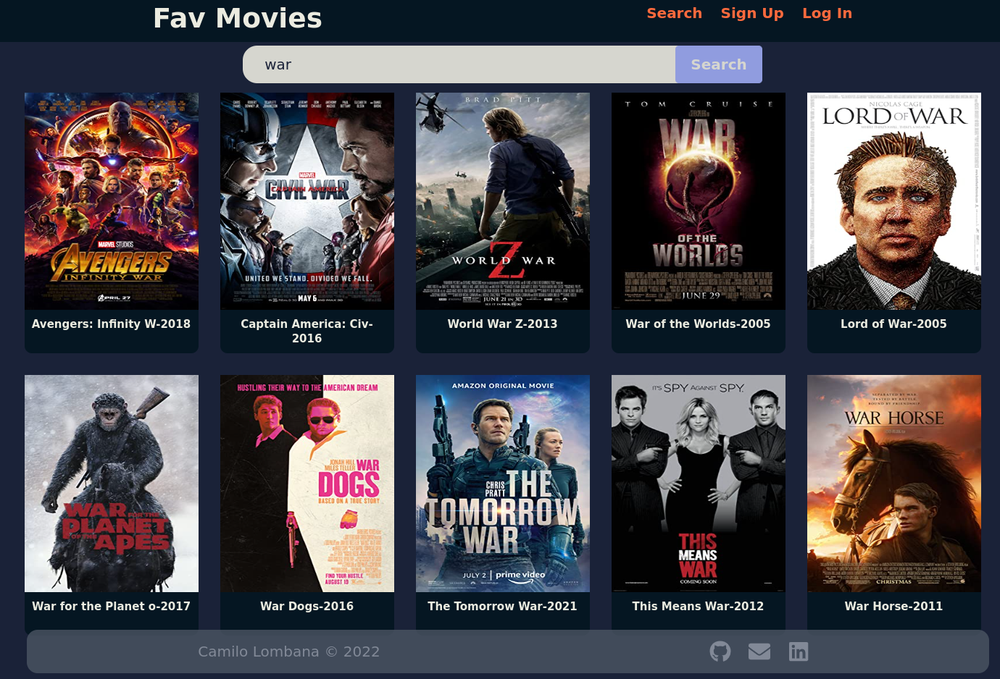
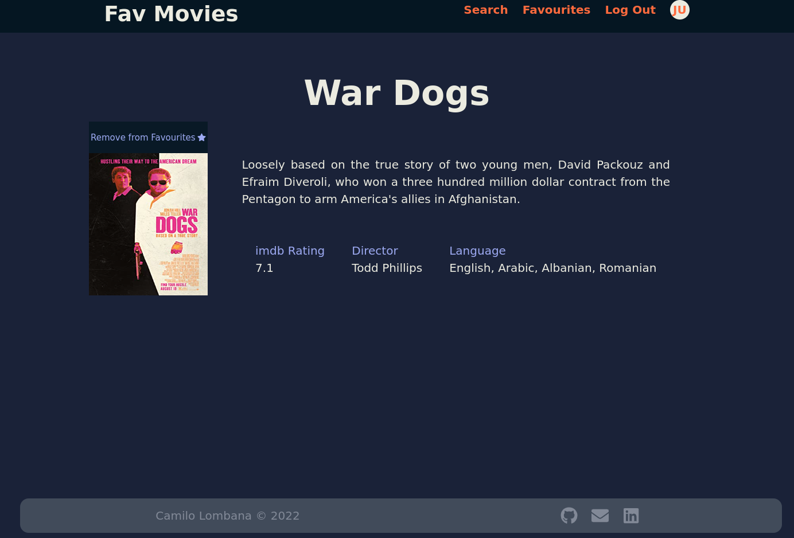
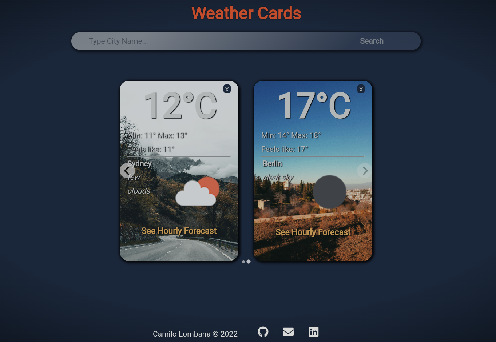
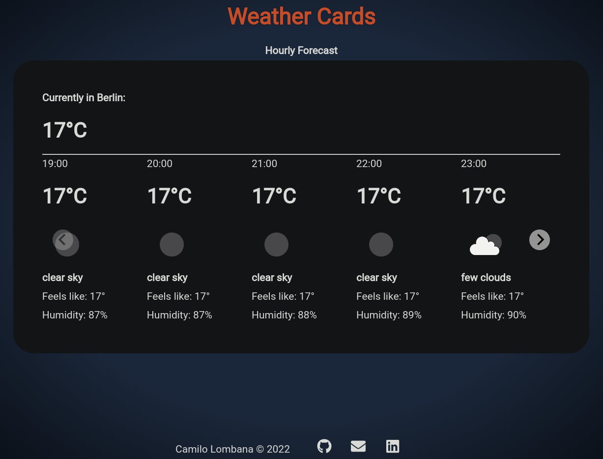
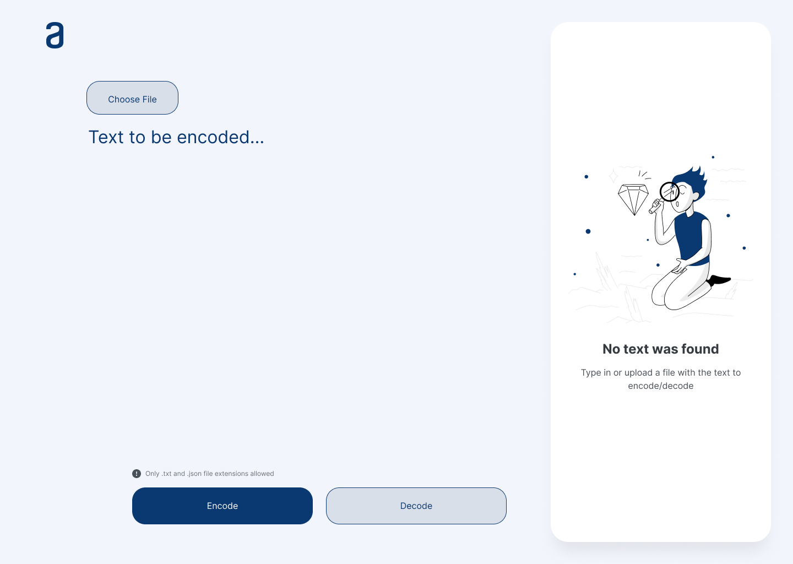
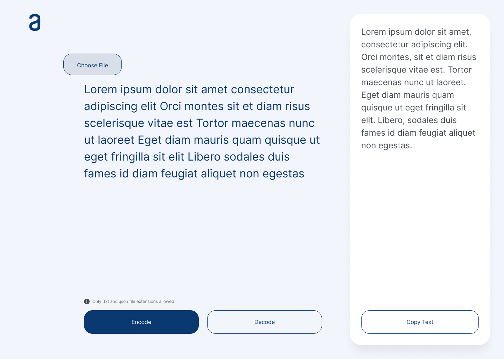

<h1 align="center">Hello 👋, I'm Camilo Lombana</h1>
<h3 align="center">A passionate full stack developer and mechanical engineer</h3>

- 🌱 I’m currently learning **Docker, AWS**

- 📫 How to reach me **lombana.camilo@hotmail.com**

<h3 align="left">Connect with me:</h3>

## Checkout my projects 👇 || check my [Portfolio Webpage](https://portfolio-lombana-camilo.vercel.app/)
____________________
## TOURIST SPOTS - [Repo](https://github.com/lombana-camilo/tourist-spots-app)

📌 Fullstack web application with authentication that enables the users to create, modify and delete their own tourist spots. Besides, all posts are displayed in a map where users can see details and leave reviews

🚀 Technologies: 
* Typescript
* React - router, forms
* Material UI
* Redux Store & RTK Query
* Zod Validation
* Node Js & Express
* MongoDb, Mongoose, Typegoose
* JSON Web Tokens, bcrypt
* Cloudynary, Multer
* MapBox

  

____________

## REAL ESTATE PROPERTIES - [Repo](https://github.com/lombana-camilo/real-estate-app)

📌 Fullstack web application with authentication that enables the user to list properties for rent or sale, filter the results and create their own ads of a new property

🚀 Technologies: 
* Javascript
* React
* Redux ToolKit Store
* Tailwind
* Node Js
* Express
* Sequelize, Postgress
* Axios,bcrypt

  

____________

## FAV MOVIES - [Repo](https://github.com/lombana-camilo/fav-movies)

📌 A react app that allows the user to search for movies, see their details and add or remove them to a favourite list.
The user can create its account, log-in and have access to its own favourite list

🚀 Technologies: 
* Javasript
* React, react-router
* Tailwind
* Redux
* Axios,bcrypt
* Firebase - FireStore

  
____________

## WEATHER APP - [Repo](https://github.com/lombana-camilo/weather-app-react)

📌 A front-end project, where the user can look up any city and get its weather information in a card. Several cards can be  displayed and each one has a link to the hourly weather report for the day. The cards show an image according to the weather and each card can also be deleted by the user.

🚀 Technologies: 
* React
* Javasript
* Sass
* Axios

  
____________

## Text Encoder/Decoder - [Repo](https://github.com/lombana-camilo/text-encoder-decoder)

📌 This app is the one of the challenges that comprise the program: *ONE - Oracle Next Education + Alura*. It enables the user to encode or decode text from keyboard input or an uploaded file. The decoded text can also be downloaded

🚀 Technologies: 
* React
* Javasript
* Sass

  

____________

<h3 align="left">Languages and Tools:</h3>

                        

